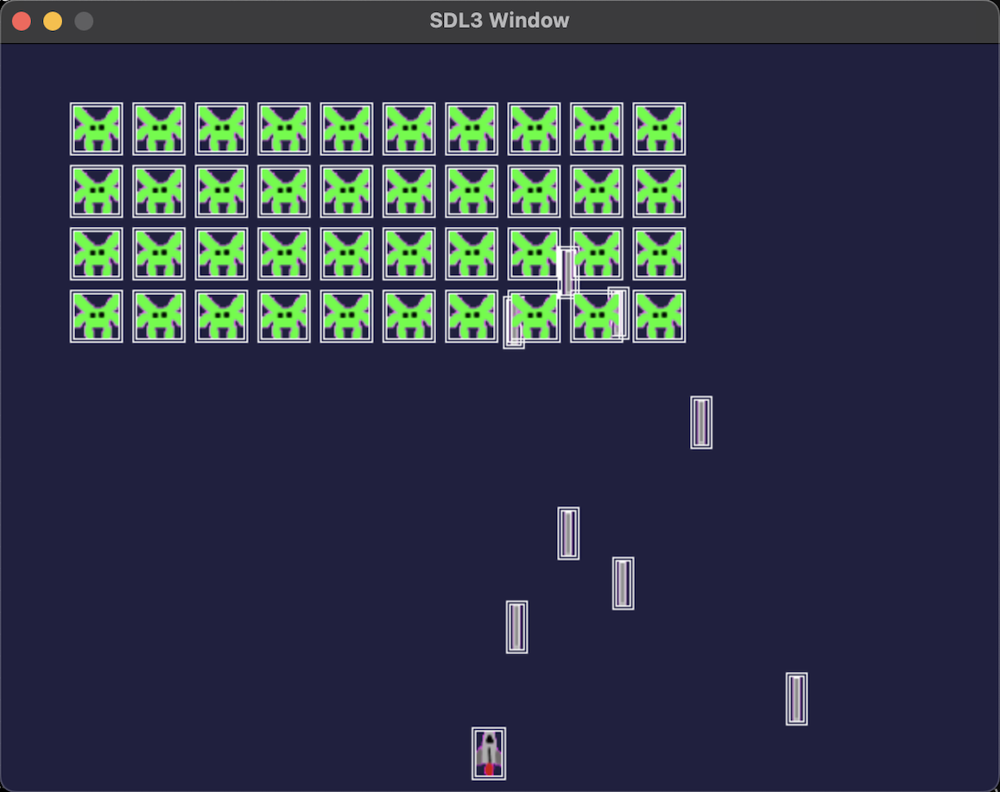

# This is a clone of a simple space invader game using SDL3 and C++

## Usage:
- Clone this repo and run `clang++ -std=c++20 ./src/main.cpp ./src/Application.cpp -I./include/ -o prog 'pkg-config --libs --cflags sdl3'`
- Run `./prog` to run the game

## Gameplay Screenshot
The square outlines of the sprites are their colliders.

